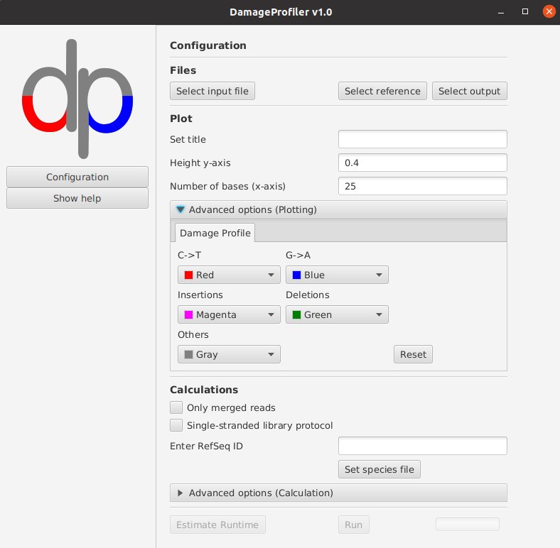

General Usage
=============

DamageProfiler can be used to calculate and visualize damage patterns in ancient DNA. As input, a mapping file (sam, bam, or cram format) is expected. The result is provided in both graphic and text-based representation. DamageProfiler can be used in offline mode, however, idenitfying the species name when running multi-reference mapping files is not possible.

It creates

    * damage plots
    * fragment length distribution
    * edit distances (number of bases that differ between read and reference)
    * base frequency table of reference (if reference is specified)
    * base frequency table of input file
    * table of different base misincorporations and their occurrences

How to run
----------

.. code-block:: console

    java -jar DamageProfiler-VERSION.jar [options]

Options:

    * **-h** 
    Shows this help page.

    * **-version** 
    Shows the version of DamageProfiler.

    * **-i INPUT** 
    The input sam/bam/cram file.

    * **-r REFERENCE** 
    The reference file (fasta format). 
    
    * **-o OUTPUT** 
    The output folder. Please specify the path to the result folder here. The folder structure will be as following: 
   
    - **If neither -s nor -sf are specified:** 
      The results will directly be stored under the output folder specified with -o

      Example:  

      -i mapping_file_sample_A.bam -o /path/to/result/directory/mapping_file_sample_A/

      The result files will then be stored in /path/to/result/directory/mapping_file_sample_A/

    - **-s is specified:**

      If more than one species is specified, the results are stored in separate folders (per species) under the specified output folder (-o).

      If only one single species is specified, the result will directly be stored under the output folder specified with -o.

      Example:

      -i mapping_file_sample_B.bam -o /home/neukamm/results_damageprofiler/ -s 'NC_002677.1'

      The results will be stored in /home/neukamm/results_damageprofiler/mapping_file_sample_B/NC_002677.1/

      -i mapping_file_sample_B.bam -o /path/to/result/directory/mapping_file_sample_B/ -s 'NC_002677.1,NC_028801.1'

      The results will be stored in /path/to/result/directory/mapping_file_sample_B/NC_002677.1/ and /path/to/result/directory/mapping_file_sample_B/NC_028801.1/ and a summary pdf will be stored in /path/to/result/directory/mapping_file_sample_B/summary.pdf

    - **-sf is specified:**

      Species are given as text file, one per line. No quotation marks needed.
      If more than one species is specified, the results are stored in separate folders (per species) under the specified output folder (-o).
      If only one single species is specified, the result will directly be stored under the output folder specified with -o.

    * **-t THRESHOLD**
    Number of bases which are considered for plotting nucleotide misincorporations in the damage plot. Default: 25.

    * **-s SPECIES**
    Reference sequence name (Reference NAME flag of SAM record). Depending on which database was used for mapping, this is the accession ID of the reference (i.e. NCBI accession ID). Commas within the Reference sequence name are not allowed.
    The species must be put in quotation marks (e.g. -s 'NC_032001.1|tax|1917232|'), multiple species must be comma separated (e.g. -s 'NC_032001.1|tax|1917232|,NC_031076.1|tax|1838137|').

    * **-sf SPECIES FILE**
    List with accession IDs of species for which damage profile has to be calculated. This file is a text file, with one species entry per line. Commas within the Reference sequence name are not allowed.

    Example:

    -i mapping_file_sample_B.bam -o /home/neukamm/results_damageprofiler/ -sf /path/to/species_file.txt

    and the content of species_file.txt would look like this:

    .. code-block:: bash

        NC_002677.1
        NC_028801.1
        NC_023501.3
        NC_035395.1

    * **-l LENGTH**
    Number of bases which are considered for frequency computations. Default: 100.

    * **-title TITLE**
    Title used for all plots. Default: input filename.

    * **-yaxis_dp_max MAX_VALUE**
    Maximal y-axis value that is visualized in the damage plot.

    * **-color_c_t COLOR_C_T** 
    Color for the line representing the C to T misincoporation frequency in the damage plot. The colour should be given as hex colour code (i.e. for magenta, set #ff00ff).

    * **-color_g_a COLOR_G_A** 
    Color for the line representing the G to A misincoporation frequency in the damage plot. The colour should be given as hex colour code (i.e. for magenta, set #ff00ff).

    * **-color_instertions COLOR_C_T**
    Color for the line representing base insertions in the damage plot. The colour should be given as hex colour code (i.e. for magenta, set #ff00ff).

    * **-color_deletions COLOR_DELETIONS**
    Color for the line representing base deletions in the dmage plot. The colour should be given as hex colour code (i.e. for magenta, set #ff00ff).

    * **-color_other COLOR_OTHER**
    Color for the line representing other bases misincorporations in the damage plot.  The colour should be given as hex colour code (i.e. for magenta, set #ff00ff).

    * **-only_merged**
    Use only mapped and merged (in case of paired-end sequencing) reads to calculate damage plot instead of using all mapped reads. The SAM/BAM entry must start with 'M\_', otherwise it will be skipped. Default: false

    * **-sslib**
    Single-stranded library protocol was used. Default: false. This option only highlights the C to T base misincorporations in the damage plot.

GUI 
-----

Running the jar file without any parameter starts the GUI to configure the run:

Log file
--------

DamageProfiler documents the configuration in a separate log file, which helps you to reproduce your analysis at a later date.
The file is saved in the specified result folder.

