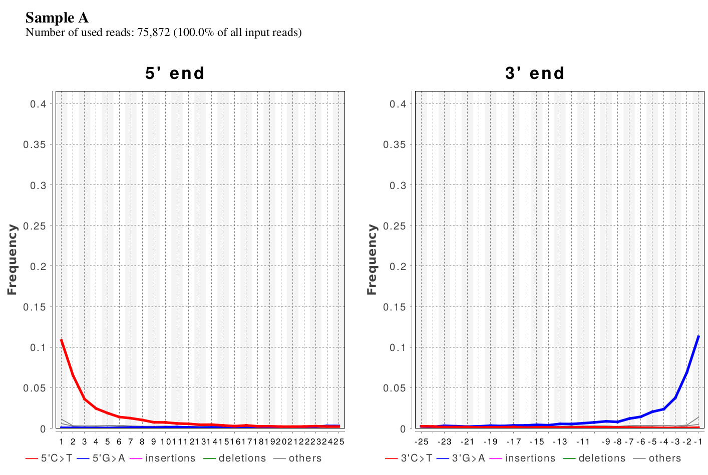
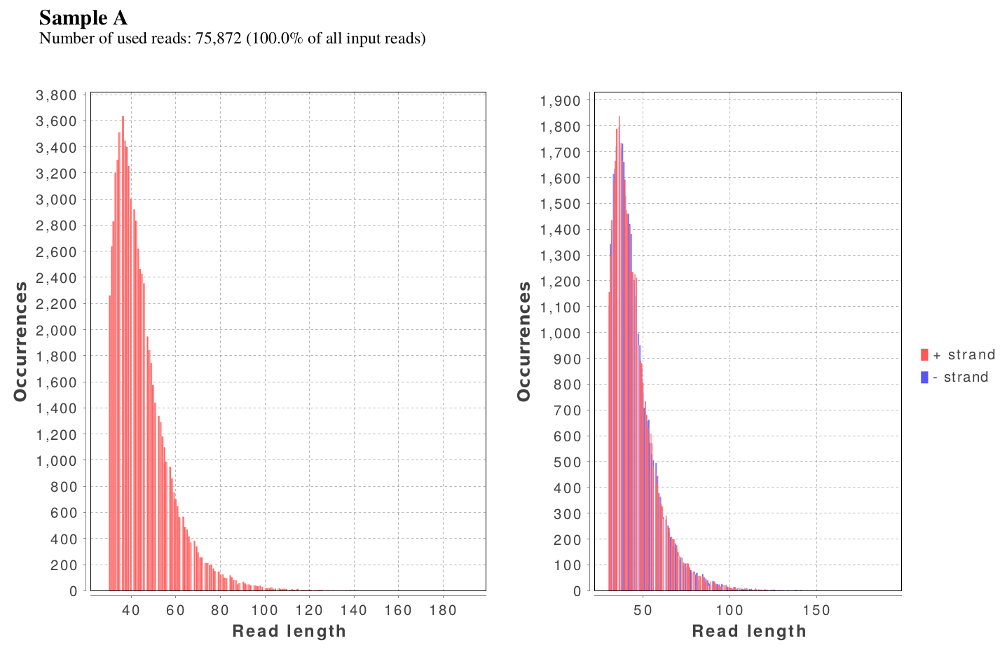
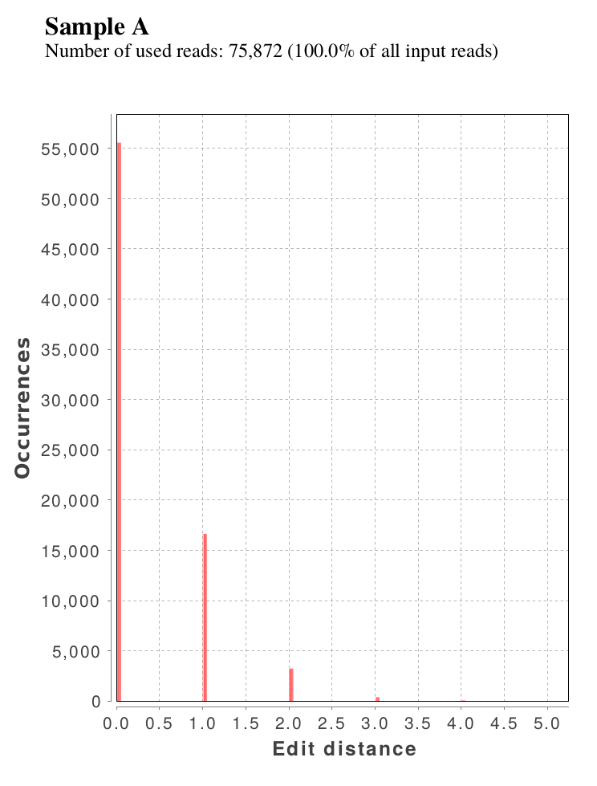

Output Files
==============

damagePlot.pdf
--------------
The damage plot visualizes the frequency of the particular base misincorporations, deletions, and insertions that occur in the considered reads. The 5' and 3' end of the reads are displayed on the left and right side, respectively. The The x-axis show the position, and the y-axis the frequency.   
The files *DamagePlot_five_prime.svg* and *DamagePlot_three_prime.svg* contain the visualization as vector graphic for easy further processing.  

length_plot.pdf
----------------

This figure visualizes the length distribution of all considered reads. The reads length is shown on the x-axis, the number of reads per lentgh on the y-axis.  
The plot on the left side shows the length histogram of all reads, while the right side separates the reads based on strand orientation.  
The files *Length_plot_combined_data.svg* and *Length_plot_forward_reverse_separated.svg* provide the plots in svg format.

edit_distance.pdf
------------------

A histogram visualizing the number of bases that differ between read and reference. The number of bases (=distance) is shown on the x-axis, the number of reads having this distance (=occurrences) on the y-axis.  
The file *edit_distance.svg* provides the plot in svg format.

5pCtoT_freq.txt and 3pGtoA_freq.txt
------------------------------------

These files are tab separated text files, containing the frequency of C to T and G to A base miscorporation at the 5' and 3'end, respectively, on which the damage plot is based. The header covers the first three lines, followed by two columns. The first column is the position, starting from the end of the fragment, and the second column contains the frequency of the respective base exchange.

Example *5pCtoT_freq.txt*:

.. code-block:: console

	# table produced by DamageProfiler
	# using mapped file /home/neukamm/mount/data/jneuka/projects/DP_publication/runtime_test/bamfiles/Motala12.ERR577498_R1.fastq.truncated.mapped.mappedonly.sorted.qF.sorted.cleaned.rmdup.MarkD.1000.bam
	# Sample ID: Motala12.ERR577498_R1.fastq.truncated.mapped.mappedonly.sorted.qF.sorted.cleaned.rmdup.MarkD.1000.bam
	pos	5pC>T
	1	0.030042918454935622
	2	0.009174311926605505
	3	0.0045871559633027525
	4	0.0
	5	0.0
	6	....	

Example *3pGtoA_freq.txt*:

.. code-block:: console

	# table produced by DamageProfiler
	# using mapped file /home/neukamm/mount/data/jneuka/projects/DP_publication/runtime_test/bamfiles/Motala12.ERR577498_R1.fastq.truncated.mapped.mappedonly.sorted.qF.sorted.cleaned.rmdup.MarkD.1000.bam
	# Sample ID: Motala12.ERR577498_R1.fastq.truncated.mapped.mappedonly.sorted.qF.sorted.cleaned.rmdup.MarkD.1000.bam
	pos	3pG>A
	1	0.011363636363636364
	2	0.0
	3	0.0
	4	0.00392156862745098
	5	0.0
	6	....

lgdistribution.txt
-------------------

.. code-block:: console

	# table produced by DamageProfiler
	# using mapped file /home/neukamm/mount/data/jneuka/projects/DP_publication/runtime_test/bamfiles/Motala12.ERR577498_R1.fastq.truncated.mapped.mappedonly.sorted.qF.sorted.cleaned.rmdup.MarkD.1000.bam
	# Sample ID: Motala12.ERR577498_R1.fastq.truncated.mapped.mappedonly.sorted.qF.sorted.cleaned.rmdup.MarkD.1000.bam
	# Std: strand of reads
	Std	Length	Occurrences
	+	31.0	1
	+	32.0	2
	+	33.0	...
	...
	-	30.0	2
	-	31.0	1
	-	32.0	...

editDistance.txt
-----------------

.. code-block:: console

	#Edit distances for file:/home/neukamm/mount/data/jneuka/projects/DP_publication/runtime_test/bamfiles/Motala12.ERR577498_R1.fastq.truncated.mapped.mappedonly.sorted.qF.sorted.cleaned.rmdup.MarkD.1000.bam
	Edit distance	Occurrences
	0.0	849
	2.0	19
	4.0	3
	1.0	125
	3.0	4

misincorporation.txt
---------------------

.. code-block:: console

	# table produced by DamageProfiler
	# using mapped file /home/neukamm/mount/data/jneuka/projects/DP_publication/runtime_test/bamfiles/Motala12.ERR577498_R1.fastq.truncated.mapped.mappedonly.sorted.qF.sorted.cleaned.rmdup.MarkD.1000.bam
	# Sample ID: Motala12.ERR577498_R1.fastq.truncated.mapped.mappedonly.sorted.qF.sorted.cleaned.rmdup.MarkD.1000.bam
	Chr	End	Std	Pos	A	C	G	T	Total	G>A	C>T	A>G	T>C	A>C	A>T	C>G	C>A	T>G	T>A	G>C	G>T	A>-	T>-	C>-	G>-	->A	->T	->C	->G	S
	fwd	3p	+	1	129.0	140.0	91.0	140.0	500.0	1.0	0.0	0.0	0.0	0.0	0.0	0.0	2.0	0.0	0.0	0.0	0.0	0.0	0.0	0.0	0.0	0.0	0.0	0.0	0.0	0.0
	fwd	3p	+	2	115.0	130.0	122.0	133.0	500.0	0.0	0.0	1.0	0.0	0.0	0.0	0.0	0.0	0.0	0.0	0.0	0.0	0.0	0.0	0.0	0.0	0.0	0.0	0.0	0.0	0.0
	....
	rev	3p	-	1	116.0	130.0	85.0	169.0	500.0	1.0	1.0	0.0	0.0	0.0	0.0	0.0	0.0	0.0	0.0	0.0	0.0	0.0	0.0	0.0	0.0	0.0	0.0	0.0	0.0	0.0
	rev	3p	-	2	112.0	138.0	113.0	137.0	500.0	0.0	1.0	0.0	0.0	0.0	0.0	0.0	0.0	0.0	0.0	0.0	1.0	0.0	0.0	0.0	0.0	0.0	0.0	0.0	0.0	0.0
	...
	fwd	5p	+	1	144.0	113.0	92.0	151.0	500.0	0.0	3.0	0.0	0.0	0.0	0.0	0.0	0.0	0.0	0.0	0.0	1.0	0.0	0.0	0.0	0.0	0.0	0.0	0.0	0.0	0.0
	fwd	5p	+	2	138.0	121.0	117.0	124.0	500.0	1.0	1.0	1.0	0.0	0.0	0.0	0.0	0.0	0.0	0.0	1.0	0.0	0.0	0.0	0.0	0.0	0.0	0.0	0.0	0.0	0.0
	...
	rev	5p	-	1	121.0	120.0	103.0	156.0	500.0	0.0	4.0	0.0	0.0	0.0	0.0	0.0	0.0	0.0	0.0	0.0	0.0	0.0	0.0	0.0	0.0	0.0	0.0	0.0	0.0	0.0
	rev	5p	-	2	130.0	97.0	129.0	144.0	500.0	0.0	1.0	0.0	0.0	0.0	0.0	0.0	0.0	0.0	0.0	0.0	0.0	0.0	0.0	0.0	0.0	0.0	0.0	0.0	0.0	0.0
	...

5p_freq_misincorporations.txt and 3p_freq_misincorporations.txt
-----------------------------------------------------------------

Example file *5p_freq_misincorporations.txt*:

.. code-block:: console

	# table produced by org.damageprofiler.calculations.DamageProfiler
	# using mapped file /home/neukamm/mount/data/jneuka/projects/DP_publication/runtime_test/bamfiles/Motala12.ERR577498_R1.fastq.truncated.mapped.mappedonly.sorted.qF.sorted.cleaned.rmdup.MarkD.1000.bam
	# Sample ID: Motala12.ERR577498_R1.fastq.truncated.mapped.mappedonly.sorted.qF.sorted.cleaned.rmdup.MarkD.1000.bam
	Pos	C>T	G>A	A>C	A>G	A>T	C>A	C>G	G>C	G>T	T>A	T>C	T>G	->ACGT	ACGT>-
	0	0.030043	0.000000	0.000000	0.000000	0.000000	0.000000	0.000000	0.000000	0.005128	0.000000	0.000000	0.000000	0.000000	0.000000
	1	0.009174	0.004065	0.000000	0.003731	0.000000	0.000000	0.000000	0.004065	0.000000	0.000000	0.000000	0.000000	0.000000	0.000000
	2	0.004587	0.000000	0.000000	0.000000	0.000000	0.009174	0.004587	0.000000	0.000000	0.000000	0.000000	0.000000	0.000000	0.000000
	3	0.000000	0.004237	0.000000	0.000000	0.000000	0.004878	0.000000	0.000000	0.004237	0.000000	0.003300	0.000000	0.000000	0.000000
	...

Example file *3p_freq_misincorporations.txt*:

.. code-block:: console

	# table produced by DamageProfiler
	# using mapped file /home/neukamm/mount/data/jneuka/projects/DP_publication/runtime_test/bamfiles/Motala12.ERR577498_R1.fastq.truncated.mapped.mappedonly.sorted.qF.sorted.cleaned.rmdup.MarkD.1000.bam
	# Sample ID: Motala12.ERR577498_R1.fastq.truncated.mapped.mappedonly.sorted.qF.sorted.cleaned.rmdup.MarkD.1000.bam
	Pos	C>T	G>A	A>C	A>G	A>T	C>A	C>G	G>C	G>T	T>A	T>C	T>G	->ACGT	ACGT>-
	24	0.000000	0.000000	0.000000	0.000000	0.000000	0.000000	0.000000	0.000000	0.000000	0.000000	0.000000	0.000000	0.000000	0.000000
	23	0.000000	0.004329	0.000000	0.000000	0.000000	0.000000	0.000000	0.000000	0.000000	0.000000	0.000000	0.000000	0.000000	0.000000
	22	0.000000	0.004274	0.000000	0.000000	0.000000	0.000000	0.000000	0.000000	0.000000	0.000000	0.000000	0.000000	0.000000	0.000000
	...

DNA_comp_genome.txt
--------------------

.. code-block:: console

	# table produced by DamageProfiler
	# using mapped file /home/neukamm/mount/data/jneuka/projects/DP_publication/runtime_test/bamfiles/Motala12.ERR577498_R1.fastq.truncated.mapped.mappedonly.sorted.qF.sorted.cleaned.rmdup.MarkD.1000.bam
	# Sample ID: Motala12.ERR577498_R1.fastq.truncated.mapped.mappedonly.sorted.qF.sorted.cleaned.rmdup.MarkD.1000.bam
	DNA base frequencies Sample
	A	C	G	T
	0.26634292118042585	0.23354639660205592	0.2356147705419278	0.26449591167559044

	DNA base frequencies Reference
	A	C	G	T
	0.26619715386690834	0.23393775035109687	0.23571571876275538	0.2641493770192394

DNA_composition_sample.txt
---------------------------

.. code-block:: console

	# table produced by DamageProfiler
	# using mapped file /home/neukamm/mount/data/jneuka/projects/DP_publication/runtime_test/bamfiles/Motala12.ERR577498_R1.fastq.truncated.mapped.mappedonly.sorted.qF.sorted.cleaned.rmdup.MarkD.1000.bam
	# Sample ID: Motala12.ERR577498_R1.fastq.truncated.mapped.mappedonly.sorted.qF.sorted.cleaned.rmdup.MarkD.1000.bam
	End	Std	Pos	A	C	G	T	Total
	3p	+	1	132	138	90	140	500
	3p	+	2	114	130	123	133	500
	3p	+	3	171	95	118	116	500
	...
	3p	-	1	117	129	84	170	500
	3p	-	2	112	137	112	139	500
	3p	-	3	149	97	119	135	500
	...
	5p	+	1	144	110	91	155	500
	5p	+	2	138	121	116	125	500
	5p	+	3	144	101	116	139	500
	...
	5p	-	1	121	116	103	160	500
	5p	-	2	130	96	129	145	500
	5p	-	3	104	113	119	164	500

dmgprof.json
------------

The values for the damage profil, the length distribution, and some additional statistics, such as mean, median, and standard deviation of the length distribution are given in json format as well. This is a very common data format for easy data interchange. It is platform independent and usable with many modern programming languages and applications. 

DamageProfiler.log
------------------

Each step of the analysis is documented in this file, which facilitates later reproduction of the analysis. 
