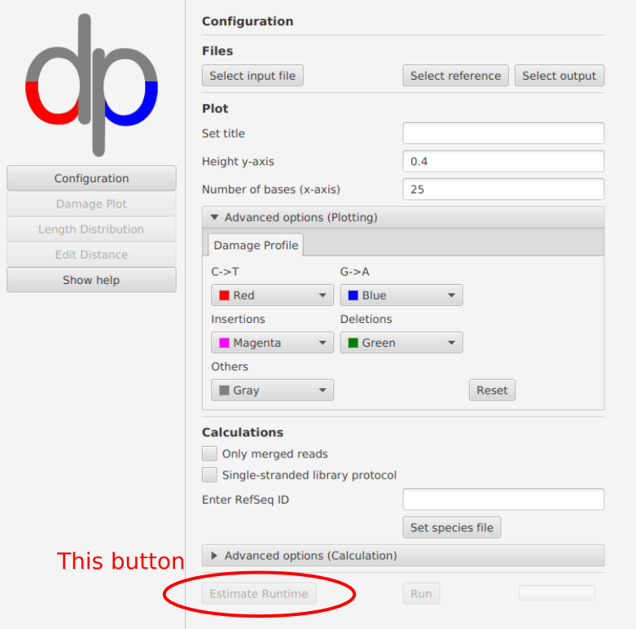
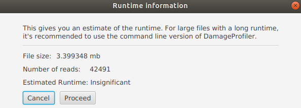

Runtime Estimation
===================

How to run
-----------
The runtime estimation works only when starting DamageProfiler via the :ref:`graphical user interface <GUI-label>`.

It is possible to estimate the runtime based on the input file size. If all required parameters are set (input file and
output directory), the *Estimate Runtime* button will be enabled in the lower part of the GUI.

A window will then open containing information about the file size, the number of records in the input file, and the
estimated runtime for processing all read operations. This can either be an actual time span or 'insignificant' if the
runtime is less than 1 second. The run can now either be aborted or continued.

How is the runtime calculated
-------------------------------
Coming soon